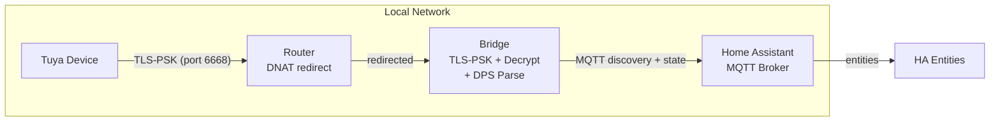

# Tuya PSK Local Cloud Bridge

A local bridge that intercepts TLS-PSK connections from Tuya/Smart Life Wi-Fi devices and exposes their state to Home Assistant via MQTT discovery.

## Scope

- **TLS-PSK termination** -- accept TLS-PSK connections using device-known material
- **MQTT payload decryption** -- AES-128-ECB decryption of Tuya's local protocol payloads
- **DPS parsing** -- extract Data Point Status from decrypted JSON
- **HA MQTT discovery** -- publish entity states and auto-discovery config to Home Assistant

## Non-Goals

This project is intentionally narrow:

| Not this | Reason |
|---|---|
| A cryptographic bypass | Uses known device material with user consent |
| A cloud replacement | Bridges local traffic only; cloud pairing still required |
| A router config mutator | Router redirection is documented but never automated |
| A Tuya Cloud API client | No cloud credentials, no cloud calls |

## First Supported Device Class

**Tuya Wi-Fi door sensor** -- DPS 1: open/closed binary sensor.

The bridge generalizes to any Smart Life Wi-Fi device with a known local key and a documented DPS mapping.

## Quick Start

See **[docs/deployment-ha-addon.md](docs/deployment-ha-addon.md)** for a step-by-step guide to running the bridge as a Home Assistant add-on.

## Architecture

## Documentation

| Doc | Description |
|---|---|
| [Architecture](docs/architecture.md) | Components, data flow, config model, deployment modes |
| [Security](docs/security.md) | Threat model, crypto details, secret handling |
| [Deployment (HA Add-on)](docs/deployment-ha-addon.md) | Step-by-step add-on install and configure |
