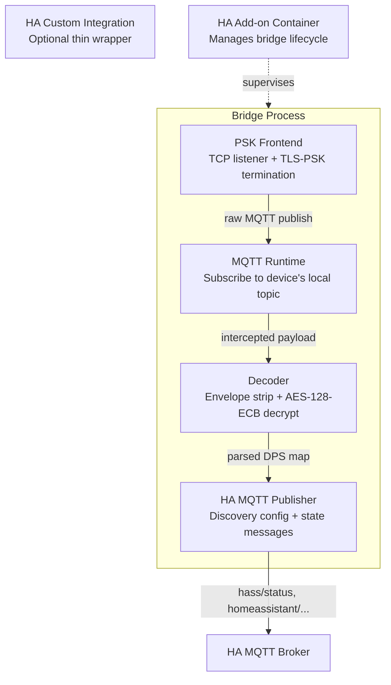

# Architecture

## Component Diagram



## Data Flow

```
1. Raw TCP
   Device opens TCP to Tuya cloud endpoint (port 6668).

2. TLS-PSK Termination
   Bridge accepts the connection using TLS_PSK_WITH_AES_128_CBC_SHA256
   with the device's identity and pre-shared key.

3. MQTT Publish Intercept
   Inside the TLS session, the device sends MQTT PUBLISH to its local
   reporting topic. Bridge's MQTT runtime captures this.

4. Envelope Strip (offset 15)
   Tuya wraps the payload with a protocol header. The first 15 bytes
   are stripped to reach the encrypted application data.

5. AES-128-ECB Decrypt
   The remaining bytes are decrypted using the device's local_key as
   the AES-128-ECB key. Output is UTF-8 JSON.

6. JSON Parse + DPS Mapping
   Decrypted JSON contains a "dps" object keyed by data-point ID.
   A per-device profile maps DPS IDs to entity types and values.

7. MQTT Discovery + State Publish
   Bridge publishes Home Assistant MQTT discovery config messages and
   state messages to the HA MQTT broker.
```

## Config Model

### Bridge-Level

```yaml
bridge:
  listen_host: "0.0.0.0"
  listen_port: 6668
  mqtt_host: "YOUR_BROKER_IP"
  mqtt_port: YOUR_MQTT_PORT
  mqtt_username: ""          # optional
  mqtt_password: ""          # optional
```

### Per-Device

```yaml
devices:
  - device_id: "0123456789abcdefabcd"
    local_key: "REDACTED_PLACEHOLDER"
    profile: "door_sensor"
    dps_map:
      "1":
        entity: "binary_sensor"
        name: "Door"
        payload_on: "true"
        payload_off: "false"
```

Profiles are reusable templates. A `door_sensor` profile ships with the
bridge; additional profiles are added via config or contributed by users.

## Deployment Modes

| Mode | Description |
|---|---|
| **HA Add-on** (preferred) | Runs inside the HA Supervisor. Lifecycle, networking, and config managed by add-on options. |
| **Standalone Docker** | Bridge runs in its own container. Config via env vars or mounted file. |
| **Manual Python** | `pip install` and run directly. Suitable for development. |

## Router Responsibility Boundary

The bridge **never** modifies router configuration. The operator sets up
DNAT/port-forward rules on their router to redirect Tuya cloud traffic to
the bridge's listening port. This is documented but not automated:

- Router handles traffic redirection only.
- Bridge only listens for incoming TLS connections.
- No SSH/CLI to routers, no firmware flashing.

## Public Repo Safety

No secrets are committed to this repository:

- Example configs use placeholder values (`REDACTED_PLACEHOLDER`).
- Real device IDs and local keys are stored in add-on options, env vars,
  or a local secrets file excluded by `.gitignore`.
- CI checks for accidental secret commits via pattern matching.
